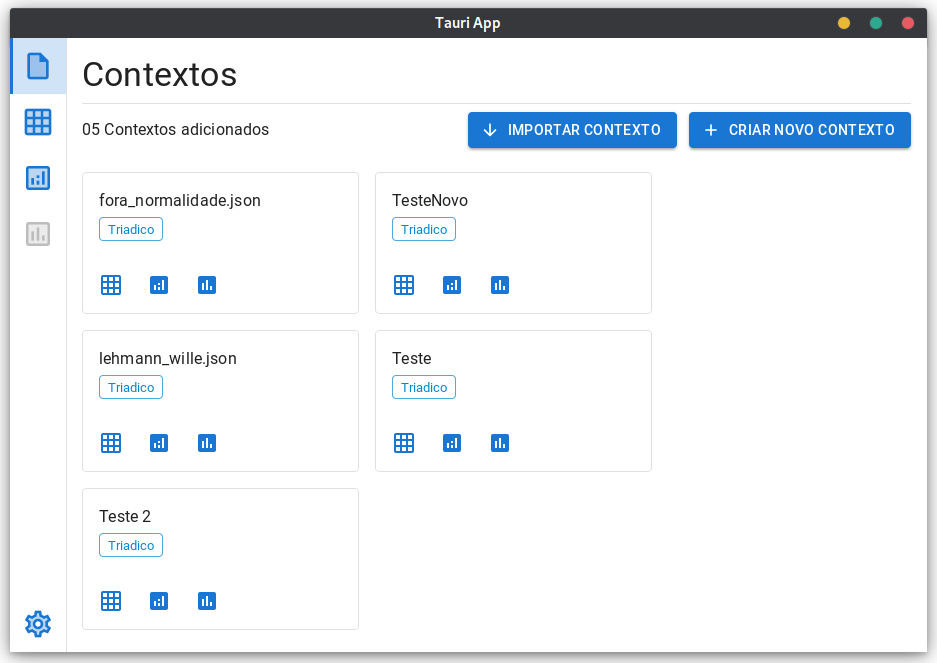
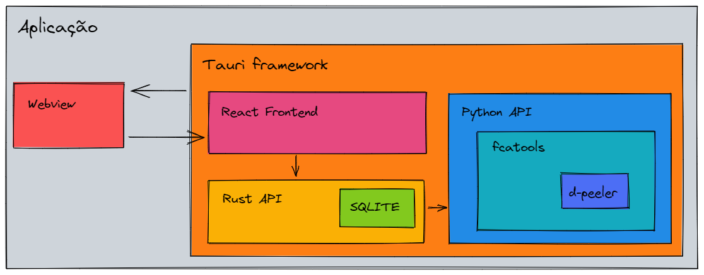

# fca-gtools

fca-gtools is a desktop formal concept analysis tool, based on the [fca-tools](https://github.com/raul4247/fca-tools) library and framework.



## Architecture overview



## Development environment

- This project has a shell.nix file, which describes the dependencies needed for development and execution, if you use the NixOS operating system or the Nix package manager, you can run the following commands:

```sh
# It will read the shell.nix and create a new shell
# with the necessary dependencies installed
nix-shell

# To install node_modules dependencies
yarn install

# It will start the execution and compilation of the project
# for the development environment
yarn dev:all
```
